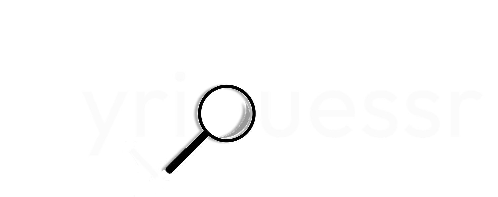

# lyriguessr

  

## The Game 

Welcome to [**lyriguessr**](https://www.lyriguessr.xyz/), where you - a presumptive music-lover - can play lyric-guessing games for all your favorite artists. I will continue to add artist games based on demand! Request new artists by interacting with me on [@lyriguessr](https://x.com/lyriguessr) on Twitter or Instagram.

The gist: earn as many points as possible by guessing the song that the generated lyric(s) comes from. The higher the difficulty level, the more points you get.

> * Easy correct guess: +1
> * Medium correct guess: +3
> * Hard correct guess: +5

If you don't have a guess, you can ask for a hint - there are three available per round, and you start with 20 available per game. You earn one extra hint for each 10 rounds you reach! Or, you could also choose to give up and move on to the next round. But keep in mind that getting hints and giving up will cost you points!

> * Hint (each): -1
> * Giving up: -2

Note that certain lyrics may appear in more than one song, but there is only one correct answer! Additionally, some lyrics may be very short and can even be just a single word - it is up to you to figure out where it comes from!

## Details

All lyrics are taken from [Genius](https://genius.com/), and are integrated into **lyriguessr** via the [lyricsgenius](https://lyricsgenius.readthedocs.io/en/master/) Python client.Each artist game is built using [Streamlit](https://streamlit.io/), and the [lyriguessr website](https://www.lyriguessr.xyz/) is built with [Quarto](https://quarto.org/).