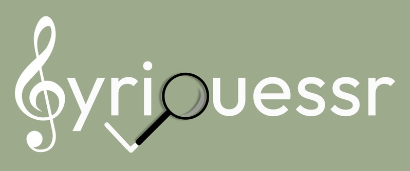

# lyriguessr

  

### The Game 

Welcome to [**lyriguessr**](https://jasminex21.github.io/lyriguessr/), where you - a presumptive music-lover - can play lyric-guessing games for all your favorite artists. 

I will continue to add artist games based on demand! Request new artists by interacting with me on [@lyriguessr](https://x.com/lyriguessr) on Twitter or Instagram.

### Details

All lyrics were taken from [Genius](https://genius.com/), and integrated into **lyriguessr** via the [lyricsgenius](https://lyricsgenius.readthedocs.io/en/master/) Python client.

Each artist game was built using [Streamlit](https://streamlit.io/), and the [lyriguessr website](https://jasminex21.github.io/lyriguessr/) was built with [Quarto](https://quarto.org/).